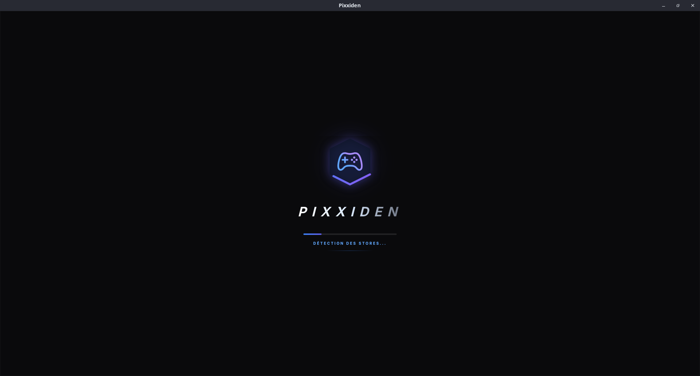
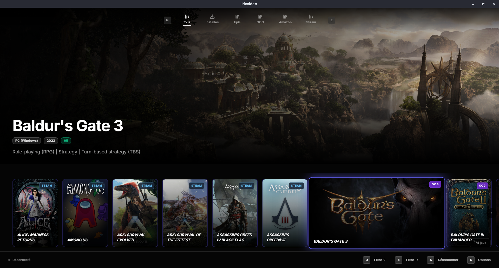
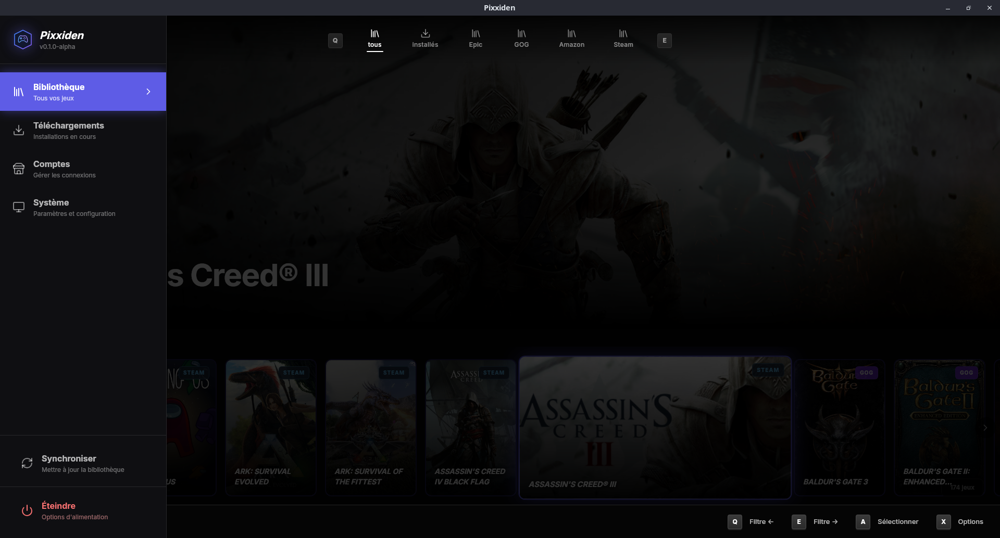
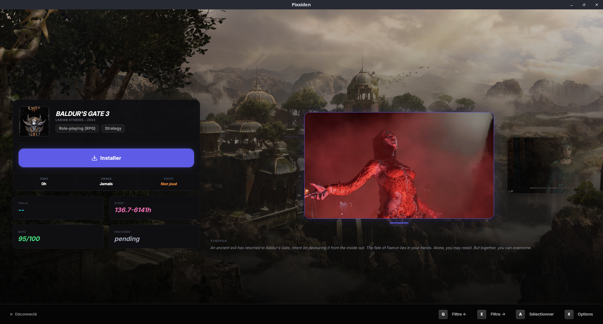

# Pixxiden Design System

Ce document définit les **guidelines de design** pour Pixxiden, une application
Vue 3 + Tailwind CSS en mode fullscreen, optimisée pour les contrôleurs de jeu.
Il sert de référence pour aligner couleurs, typographie, composants, et
interactions sur toute la base de code.

---

## 1. Fondations

### Principes directeurs

1. **Minimalisme & lisibilité**  
   Interface sombre de fond, typo grande, focus sur l'info de jeu. Zéro
   éléments superflus.

2. **Gamepad-first**  
   Tous les composants interactifs se contrôlent via `useGamepad()` et
   `useFocusNavigation()`. Les indicateurs visuels de focus doivent être
   clairs (outline Tailwind via `focus-visible`).

3. **Accessibilité WCAG AA**  
   Contraste suffisant, support clavier natif, navigation par tab. Rôles ARIA
   quand nécessaire.

### Stack technique

- **Framework UI** : Vue 3 (composants `<script setup>`)
- **Styling** : Tailwind CSS (config : [tailwind.config.js](../../tailwind.config.js))
- **Icônes** : `lucide-vue-next` (imports directs, pas de chemins asset)
- **Animations** : Keyframes Tailwind + utilitaires CSS

---

## 2. Thème & Couleurs

Le thème noir profond + indigo neon.  
Classes Tailwind de [tailwind.config.js](../../tailwind.config.js) :

### Couleurs principales

```plaintext
remix-black         #050505   Fond principal (true black)
remix-bg-dark       #000000   Pure black (fallback)
remix-bg-panel      #0f0f12   Sidebar background
remix-bg-card       #0a0a0a   Card backgrounds
remix-bg-content    #141419   Main content area
remix-bg-hover      #2A2A2F   Hover state léger
remix-accent        #5e5ce6   Indigo neon (boutons, focus)
remix-accent-hover  #7c7ae8   Indigo accentué au hover
remix-text-primary  #ffffff   Texte principal
remix-text-secondary #8e8e93  Texte secondaire
remix-text-muted    #8e8e93   Texte pâle
remix-border        #1f1f1f   Bordures subtiles
```

### Couleurs sémantiques

```plaintext
success   #10B981   Actions positives
warning   #F59E0B   Avertissements
error     #EF4444   Erreurs, dangers
```

### Ombres & Glow

```plaintext
shadow-glow         0 0 20px rgba(94, 92, 230, 0.4)    Indigo doux
shadow-glow-strong  0 0 30px rgba(94, 92, 230, 0.5)    Indigo intense
shadow-glow-subtle  0 0 15px rgba(94, 92, 230, 0.3)    Indigo discret
shadow-card         0 4px 6px -1px rgba(0, 0, 0, 0.3)  Ombre de carte
```

**Utilisation** :  
Utilisez le composant **Button.vue** pour appliquer les couleurs correctement :

```tsx
<Button variant="primary">Cliquez-moi</Button>
<!-- Applique automatiquement : bg-remix-accent shadow-glow et hover:shadow-glow-strong -->
```

Ne pas utiliser les styles Tailwind directement sur des `<button>` HTML.

---

## 3. Typographie

### Police

- **Sans-serif** : `Inter` (par défaut)
- **Display** : `Poppins` (titres optionnels)

Déclarées dans `tailwind.config.js` :

```js
fontFamily: {
  sans: ["Inter", "system-ui", "sans-serif"],
  display: ["Poppins", "Inter", "sans-serif"],
}
```

### Tailles

Utiliser les tailles Tailwind standard (`text-xs`, `text-sm`, `text-base`, etc.) :

| Classe      | Taille     | Cas d'usage                  |
| ----------- | ---------- | ---------------------------- |
| `text-xs`   | 0.75rem    | Labels, hints, metadata      |
| `text-sm`   | 0.875rem   | Descriptions secondaires     |
| `text-base` | 1rem       | Corps de texte standard      |
| `text-lg`   | 1.25rem    | Sous-titres, info importantes |
| `text-xl`   | 1.5rem     | Titres de section            |
| `text-2xl`  | 2rem       | Titres principaux            |

### Poids

```
font-light:   300
font-normal:  400
font-semibold: 600  ← Par défaut pour les boutons
font-bold:    700   ← Pour les titres
```

---

## 4. Composants UI

Tous les composants vivent dans [src/components/ui](../../src/components/ui).  
**Convention** : Pas de préfixe, fichiers nommés en PascalCase.

### Button.vue

Bouton multivariant avec support loading et disabled.

**Variantes** : `primary` | `success` | `danger` | `ghost` | `outline`  
**Tailles** : `sm` | `md` | `lg`

```tsx
<script setup lang="ts">
import { Button } from "@/components/ui";
import { Play } from "lucide-vue-next";
</script>

<template>
  <Button variant="primary" size="lg" :loading="isLoading" @click="launch">
    <template #icon>
      <Play class="w-5 h-5" />
    </template>
    Lancer le jeu
  </Button>
</template>
```

### Card.vue

Conteneur avec header/body/footer optionnel.

```tsx
<Card title="Mes jeux" label="LIBRARY">
  <div class="space-y-4">
    <!-- contenu -->
  </div>
</Card>
```

Variantes : `default` (gris clair) | `dark` (noir) | `bordered`

### Modal.vue

Dialogue fullscreen. Fermeture via `Esc` ou `BackButton`.

```tsx
<Modal v-model="isOpen" title="Paramètres">
  <div class="p-6">Contenu</div>
</Modal>
```

### Input.vue

Champ texte avec support placeholder/disabled/error.

```tsx
<Input v-model="query" placeholder="Rechercher..." />
```

### Select.vue

Menu déroulant gamepad-friendly. Uses `lucide-vue-next` pour chevrons.

```tsx
<Select v-model="platform" :options="['Steam', 'Epic', 'GOG']" />
```

### Toggle.vue

Interrupteur avec animation slide. Utilisable au gamepad (focus + A).

```tsx
<Toggle v-model="darkMode" label="Mode sombre" />
```

### Badge.vue

Petit label de statut.

```tsx
<Badge variant="success">Installé</Badge>
<Badge variant="warning">Mise à jour disponible</Badge>
```

### ProgressBar.vue

Barre de progression linéaire avec animation optional.

```tsx
<ProgressBar :value="progress" :max="100" :indeterminate="!isDone" />
```

### ControllerButton.vue

Affiche les touches clavier ou contrôleur correspondant à une action (A, B, menu).

---

## 5. Icônes (lucide-vue-next)

### Installation

Icônes via le package npm **`lucide-vue-next`** (v0.309.0+).

### Imports

N'importer **que les icônes utilisées** (tree-shake automatique) :

```tsx
import { Download, Play, Square, Settings } from "lucide-vue-next";

const userIcon = ref<typeof Download>(Download);
```

### Utilisation en template

```tsx
<template>
  <div class="flex gap-2">
    <!-- Direct -->
    <Play class="w-5 h-5 text-remix-accent" />

    <!-- Via computed/ref -->
    <component :is="userIcon" class="w-6 h-6" />
  </div>
</template>
```

### Iconographie commune

| Action        | Icône Lucide   |
| ------------- | -------------- |
| Jouer         | `Play`         |
| Pause         | `Pause`        |
| Arrêter       | `Square`       |
| Télécharger   | `Download`     |
| Paramètres    | `Settings`     |
| Menu/Burger   | `Menu`         |
| Fermer        | `X`            |
| Retour        | `ChevronLeft`  |
| Voir plus     | `ChevronDown`  |
| Supprimer     | `Trash2`       |
| Erreur        | `AlertTriangle` |

**Pas de chemins asset** — importations directes du package npm.

---

## 6. États & Interactions

### Focus (mode gamepad/clavier)

L'**unique** indicateur d'interactivité au gamepad est le focus visuel.

```css
:focus-visible {
  outline: 2px solid <remix-accent>;
  outline-offset: 2px;
}
```

Utiliser les classes Tailwind pour implémenter :

```tsx
<button class="focus:outline-2 focus:outline-remix-accent focus:outline-offset-2">
  Cliquable
</button>
```

### Transitions animées

Tailwind propose des keyframes pour cohérence :

```js
animation: {
  "fade-in": "fadeIn 0.3s ease-in-out",
  "slide-up": "slideUp 0.3s ease-out",
  "scale-in": "scaleIn 0.2s ease-out",
  "glow-pulse": "glowPulse 2s ease-in-out infinite"
}
```

**Exemple** :

```tsx
<div class="animate-fade-in">Apparaît doucement</div>
<div class="animate-slide-up">Glisse vers le haut</div>
<div class="animate-glow-pulse shadow-glow">Pulse indigo</div>
```

### États d'interaction

- **Hover** : `hover:bg-remix-accent-hover` (gamepad : peu pertinent)
- **Disabled** : `disabled:opacity-60 disabled:cursor-not-allowed`
- **Loading** : spinner SVG embarqué dans Button
- **Active/Pressed** : légère translation `-translate-y-0.5` + glow intensifié

### Exemple complet (Button au gamepad)

```vue
<Button
  variant="primary"
  class="transition-all duration-300 focus:ring-2 focus:ring-remix-accent/50"
  @click="handleAction"
>
  <template #icon>
    <Play class="w-5 h-5" />
  </template>
  Jouer
</Button>
```

Au gamepad :
1. Naviguer via `useFocusNavigation()` → focus visuel `outline`
2. Presser A → `@click` déclenche action
3. Button peut montrer loader (`loading` prop)

---

## 7. Patterns & Conventions

### Composants autonomes

Tous les composants doivent être **autonomes** — contrôlables via props et emits.

**Mauvais** : Component parent gère état enfant (tight coupling)

```tsx
<SideNav :activeItem="activeItem" @select="activeItem = $event" />
```

**Bon** : Component gère propre état, communique via events

```tsx
<SideNav @navigate="route.push($event.route)" />
```

### Services pour logique métier

La logique métier (API, auth, enrichissement) belong aux services TypeScript,
pas aux composants Vue. Exemple :

```ts
// src/services/GameLibraryOrchestrator.ts
export class GameLibraryOrchestrator {
  async fetchGames() { ... }
  async launchGame(id: string) { ... }
}
```

Composants consomment via Pinia stores :

```tsx
import { useLibraryStore } from "@/stores/library";

const { games } = useLibraryStore();
```

### Pinia (State Management)

Stores in [src/stores](../../src/stores/) pour données partagées (library,
auth, downloads). Un store = un domaine métier.

### Composables (VueUse + custom)

- `useGamepad()` – Détection contrôleur + événements gamepad
- `useFocusNavigation()` – Navigation grille (gamepad/flèches)
- `useGamepadScroll()` – Stick droit pour scroller

Importés directement depuis [src/composables](../../src/composables/).

---

## 8. Ressources & Mise à jour

### Fichiers clés

- **Config styles** : [tailwind.config.js](../../tailwind.config.js)
- **Global CSS** : [src/style.css](../../src/style.css)
- **Composants UI** : [src/components/ui](../../src/components/ui/)
- **Composables** : [src/composables](../../src/composables/)
- **E2E examples** : [e2e/README.md](../../e2e/README.md)

### Vérification

Avant de commit, lancer :

```bash
bun run lint        # oxlint + auto-fix
bun run type-check  # Vérification TypeScript
bun run test        # Tests unitaires (mode watch)
bun run test:run    # Single run
```

### Modification du Design System

Toute modification de couleurs, composants ou patterns doit être :

1. **Testée** : `bun run test` (au minimum un snapshot)
2. **Lintée** : `bun run lint`
3. **Documentée** ici (ce fichier)
4. **Validée** : PR review avant merge

### Migration depuis anciennes conventions

Si vous trouvez du code utilisant :

- ❌ `@iconify/vue` → Remplacer par `lucide-vue-next`
- ❌ Chemins CSS abs → Utiliser classes Tailwind
- ❌ Styles inline → Déplacer en `<style scoped>` ou classes Tailwind
- ❌ Composants sans typage TypeScript → Ajouter `<script setup>` avec types

---

## 9. Screenshots & Exemples Visuels

### Emplacements

Les screenshots doivent être stockés dans :

```
docs/images/design-system/
├── 01-splashscreen.png        (SplashScreen.vue)
├── 02-library-home.png         (LibraryFullscreen.vue - liste jeux)
├── 03-library-with-sidenav.png (LibraryFullscreen.vue + SideNav visible)
└── 04-game-detail.png          (GameDetails.vue)
```

### Pages Vue à capturer

| Screenshot | Vue | Cas d'usage | Notes |
| --- | --- | --- | --- |
| `01-splashscreen.png` | [SplashScreen.vue](../../src/views/SplashScreen.vue) | Écran de démarrage (authentification, initialisation) | Montrer le logo Pixxiden, spinner de chargement |
| `02-library-home.png` | [LibraryFullscreen.vue](../../src/views/LibraryFullscreen.vue) | Affichage de la bibliothèque (grille de jeux) | Sans SideNav (fullscreen library) |
| `03-library-with-sidenav.png` | [LibraryFullscreen.vue](../../src/views/LibraryFullscreen.vue) + [SideNav](../../src/components/layout/SideNav.vue) | Bibliothèque avec navigation latérale | Montrer filtres actifs, badges de statut |
| `04-game-detail.png` | [GameDetails.vue](../../src/views/GameDetails.vue) | Détail du jeu (cover, actions, description) | Montrer bouton Play, contenu enrichi |

### Comment capturer

**Option 1 : Mode développement manuel**

```bash
bun run tauri:dev
# Naviguer à la page souhaitée via l'UI gamepad/clavier
# Presser PrintScreen ou utiliser DevTools screenshot
```

**Option 2 : E2E automated (recommandé)**

```bash
bun run test:e2e:headless -- --spec "01-library-browsing.spec.ts"
# Extraire les screenshots du répertoire e2e/screenshots/
```

### Dimensions recommandées

- **Résolution** : 1920×1080 (16:9, écran TV standard)
- **Format** : PNG (compression sans perte)
- **Taille fichier** : < 500 KB par image

### Ajout aux sections

Une fois les screenshots capturés, ajouter une nouvelle section **"10. Exemples d'écrans"** avant la conclusion :

## 10. Exemples d'écrans

### 1. SplashScreen - Initialisation



*Écran de démarrage avec logo Pixxiden, spinner de loading, et barre de progression.*

### 2. LibraryFullscreen - Vue liste (sans SideNav)



*Grille de jeux en fullscreen. Affiche : cover game, titre, badges (installed/updating), focus ring au gamepad.*

### 3. LibraryFullscreen - Vue avec SideNav



*Même vue avec navigation latérale visible. Filtres actifs, icônes, focus sur menu.**

### 4. GameDetails - Détail d'un jeu



*Écran détail : cover haute résolution, titre, description enrichie, boutons Play/Update, stats (playtime, ajouté le...).*
